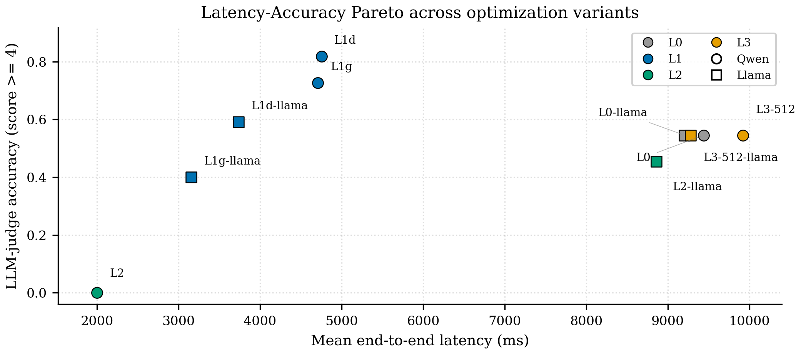
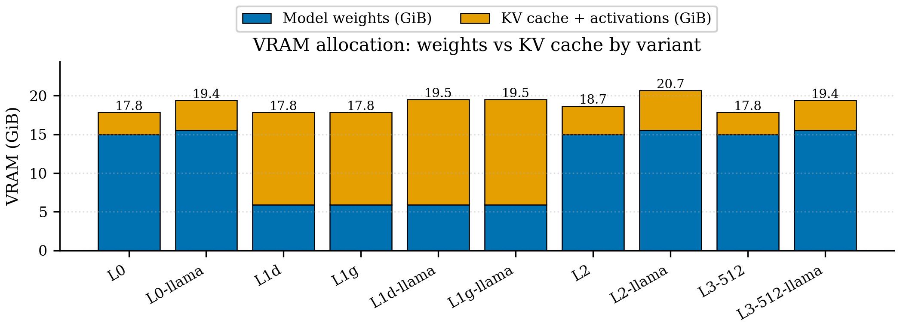

# HPML Final Project: Multi-Modal Agent Inference Optimization for Industrial Asset Operations

> **Course:** High Performance Machine Learning
> **Semester:** Spring 2026
> **Instructor:** Dr. Kaoutar El Maghraoui
> **University:** Columbia University

We extended [AssetOpsBench](https://github.com/IBM/AssetOpsBench) (AAAI 2026) with a multi modal Visual Inspection Agent and applied AWQ W4A16 quantization. On a single NVIDIA L4 GPU, domain calibrated INT4 cuts mean end to end latency by 1.99x on Qwen2.5 VL 7B and 2.46x on Llama 3 LLaVA NeXT 8B, with weight VRAM dropping from 15.5 GiB to 5.9 GiB on the Llama family.

---

## Team Information

**Team Name:** Columbia HPML Team 23, AssetOpsBench Vision

**Members:**

* **Amaan Sheikh** (aas2438). ReAct orchestrator, vision MCP server, benchmark harness, pump impeller scenarios (IDs 201 to 205), WandB instrumentation, LLM as judge methodology, plot pipeline, Qwen L2 serving tuning bundle, Llama L1g (generic AWQ).
* **Aman Upganlawar** (au2327). Turbine blade scenarios (IDs 301 to 305), dataset registry refactor and four dataset acquisition writeup, vLLM client, ReAct vs Plan Execute agent comparison, Qwen L1g (generic AWQ), Llama L3 image resolution preprocessing, checkpoint verifier, GCP infrastructure jointly with Eric.
* **Madhav Rajkondawar** (mr4650). Qwen2.5 VL 7B optimization track (L1d AWQ and L3 image preprocessing at 512 px), motor thermal scenarios (IDs 503, 507, 509, 510, 515, 517), variant registry framework with the 17 case test suite, cross variant Weights and Biases summary dashboard, domain vs generic calibration finding, Python environment pinning via the uv lockfile.
* **Yang Jung (Eric) Chen** (yc4670). Llama 3 LLaVA NeXT 8B optimization track (L1d AWQ and L2 full bundle serving tuning), transformer and substation scenarios (IDs 1, 6, 9, 10, 14, 20), Stage 1 calibration corpus, PyTorch Profiler, vLLM serve scripts and IAP tunneled bench wrapper, GCP infrastructure jointly with Aman, reproduction documentation.

## Submission

* **GitHub repository:** [https://github.com/amaan784/hpml-final-project](https://github.com/amaan784/hpml-final-project)
* **Final report:** [`report/main.tex`](report/main.tex) (PDF compiled at submission time, also under `deliverables/HPML_Final_Report.pdf`)
* **Final presentation:** [`presentation/HPML Final Presentation Slides.pptx`](presentation/HPML%20Final%20Presentation%20Slides.pptx)
* **Experiment tracking dashboard:** [https://wandb.ai/amaan784-columbia-university/hpml-final-benchmark](https://wandb.ai/amaan784-columbia-university/hpml-final-benchmark?nw=nwusermr4650)
* **Medium article:** [How We Made an Industrial AI Agent 2x Faster and More Accurate on a $0.70/hour GPU](https://medium.com/@aman.upg27024/how-we-made-an-industrial-ai-agent-2x-faster-and-more-accurate-on-a-0-70-hour-7ce5985098cb)
* **Hugging Face Qwen quantized model:** [amaan784/Qwen2.5-VL-7B-AWQ-W4A16-substation](https://huggingface.co/amaan784/Qwen2.5-VL-7B-AWQ-W4A16-substation)
* **Hugging Face Llama quantized model:** [amaan784/Llama3-LLaVA-NeXT-8B-AWQ-W4A16-substation](https://huggingface.co/amaan784/Llama3-LLaVA-NeXT-8B-AWQ-W4A16-substation)

The final report PDF and the presentation file are checked into the `deliverables/` folder of this repository and uploaded to CourseWorks at submission.

---

## 1. Problem Statement

AssetOpsBench (AAAI 2026) covers 141 industrial AI scenarios across text and time series modalities, but it has no vision component. That gap matters in practice because many failure modes (corrosion, ice buildup, bearing damage, casting defects, transformer hot spots) are visible long before sensor data flags them. The natural way to close the gap is to bring a vision language model into the AssetOpsBench agent loop, but doing that on commodity hardware is expensive. At FP16, Llama 3 LLaVA NeXT 8B occupies 15.5 GiB of weight VRAM and produces a 9.3 second per query mean latency on a single NVIDIA L4, which leaves almost no key value cache headroom for batched multi agent workloads.

A naive INT4 quantization (using a generic calibration corpus) appears faster on average, but it also surfaces a runaway generation failure mode: in the final 22-scenario sweep, two Llama L1g transformer scenarios timed out at the token cap at around 122 seconds (dropping its judged denominator from 44 to 40). That kind of tail behavior is unacceptable for industrial deployment.

This project targets inference side optimization. We add a vision modality to AssetOpsBench through a VLM powered MCP agent, then we make it cheap and reliable on a single NVIDIA L4 GPU through quantization, calibration regime selection, vLLM serving tuning, and image preprocessing changes.

**Goal.** Achieve at least a 2x end to end speedup with domain calibrated AWQ INT4 on a single L4, while preserving task accuracy and avoiding the runaway generation failure mode that generic calibration introduced on prior runs.

---

## 2. Model/Application Description

**Model architectures.**

* Primary track: `Qwen/Qwen2.5-VL-7B-Instruct` (7B parameters, native ViT vision tower).
* Cross family baseline: `llava-hf/llama3-llava-next-8b-hf` (Llama 3 8B with the LLaVA NeXT CLIP based vision tower). We originally targeted Llama 3.2 Vision 11B but its 22 GB FP16 footprint left no headroom on the 24 GB L4, so we substituted the 8B variant instead.

**Framework and serving.** vLLM 0.19.0, llmcompressor 0.10.0.2, compressed-tensors 0.14.0.1, transformers 4.57.6, PyTorch 2.10.0+cu129. Agent orchestration uses the [Model Context Protocol](https://modelcontextprotocol.io/). An in process ReAct agent ([`src/agent/react/`](src/agent/react/)) talks to a custom `vision-mcp-server` ([`src/servers/vision/main.py`](src/servers/vision/main.py)) over MCP stdio. The server exposes `vision.analyze_image`, `vision.assess_condition`, and `vision.detect_visual_defects` tools that conform to the AssetOpsBench agent contract. A Plan Execute runner ([`src/agent/plan_execute/`](src/agent/plan_execute/)) is included so we can compare the two agent architectures.

**Datasets.** Four publicly available industrial image datasets, totaling roughly 10,800 images. Hand authored scenarios live under [`src/scenarios/local/`](src/scenarios/local/).

| Domain | Dataset | Approximate size | Scenarios file |
|---|---|---|---|
| Pump impeller | Kaggle Casting Product (defect detection) | 7,348 images | [`vision_pump_scenarios.json`](src/scenarios/local/vision_pump_scenarios.json) (IDs 201 to 205) |
| Induction motor (thermal) | Mendeley Thermal Induction Motor (11 fault classes) | 488 thermal images | [`vision_utterance_motor.json`](src/scenarios/local/vision_utterance_motor.json) (IDs 503, 507, 509, 510, 515, 517) |
| Transformer and substation | HuggingFace 15 class Substation Equipment (YOLO annotated) | 1,660 RGB photos | [`vision_transformer_scenarios.json`](src/scenarios/local/vision_transformer_scenarios.json) (IDs 1, 6, 9, 10, 14, 20) |
| Wind turbine blade | Blade30 Wind Turbine Blades (defect annotations) | 1,302 drone images | [`vision_turbine_scenarios.json`](src/scenarios/local/vision_turbine_scenarios.json) (IDs 301 to 305) |

The calibration corpus in [`benchmark/calibration.py`](benchmark/calibration.py) provides 128 hand authored substation inspection text prompts for the domain calibration regime. The generic calibration regime pulls 128 samples at runtime from `HuggingFaceH4/ultrachat_200k`.

**Custom layers and modifications.**

* GPTQ W4A16 recipe with `ignore=["re:.*vision_tower.*","re:.*multi_modal_projector.*"]`. The vision tower stays in FP16 because vision encoders quantize poorly at INT4 for the LLaVA family.
* Custom MCP vision server with five tools and per domain priming. Unified HuggingFace and local image registry in [`src/servers/vision/image_loader.py`](src/servers/vision/image_loader.py).
* Variant registry framework ([`benchmark/variants/base.py`](benchmark/variants/base.py)). Ten active variants registered (L0, L1d, L1g, L2, L3 for both Qwen and Llama). Driven by the harness in [`benchmark/run_vlm_benchmark.py`](benchmark/run_vlm_benchmark.py).
* LLM as judge scoring in [`benchmark/llm_judge.py`](benchmark/llm_judge.py) replaces the upstream substring match auto scorer.

**Hardware target.** GCP `g2-standard-8` with one NVIDIA L4 24 GB, CUDA 12.9, Ubuntu 22.04. Provisioning lives under [`terraform/`](terraform/). Columbia Insomnia is available as a fallback.

---

## 3. Final Results Summary

The headline numbers come from the final 22-scenario sweep covering all four asset classes (5 pump + 6 transformer + 5 turbine + 6 motor), across 10 optimization variants. Each scenario is judged twice by `gpt-4o-mini` (pass when score ≥ 4), giving a maximum denominator of 44 per variant. Raw per-variant data is in [`results/hpml_metrics.csv`](results/hpml_metrics.csv); per-scenario judge scores are in [`results/llm_judge.csv`](results/llm_judge.csv).

### 3.1 Qwen2.5 VL 7B, primary track

| Metric | Baseline FP16 (L0) | Optimized AWQ W4A16 domain (L1d) | Improvement |
|---|---:|---:|---|
| LLM as judge accuracy | 47.7% (21/44) | **81.8% (36/44)** | **+34.1 pp** |
| Mean end to end latency | 9,437 ms | **4,752 ms** | **1.99x faster** |
| p50 end to end latency | 5,915 ms | 4,312 ms | 1.37x faster |

### 3.2 Llama 3 LLaVA NeXT 8B, cross family baseline

| Metric | Baseline FP16 (L0) | Optimized AWQ W4A16 generic (L1g) | Improvement |
|---|---:|---:|---|
| Mean end to end latency | 9,203 ms | **3,157 ms** | **2.92x faster** |
| p50 end to end latency | 9,384 ms | 3,136 ms | 2.99x faster |
| LLM as judge accuracy | 52.3% (23/44) | 40.0% (16/40) | 12.3 pp lower |

For the Llama track, the L1d (domain) variant gives 2.46x mean speedup at 59.1% accuracy (26/44). The Llama family also shows a 2.6x weight VRAM reduction (15.54 GiB to 5.9 GiB) and a 4.7x growth in the key value cache pool (21K to 100K concurrent tokens), confirmed from vLLM's `gpu_model_runner` startup logs. The L1g denominator is 40 (not 44) due to a logging gap on two transformer scenarios.

**Hardware.** One NVIDIA L4 24 GB on GCP `g2-standard-8`, CUDA 12.9, vLLM 0.19, PyTorch, Ubuntu 22.04.

**Headline result.** AWQ W4A16 quantization with domain matched calibration on Qwen2.5 VL 7B nearly halves mean end to end inference latency (9.44 s to 4.75 s, 1.99x) while improving LLM as judge accuracy from 47.7% to 81.8% on a single L4 GPU. The Qwen and Llama families respond differently to INT4 quantization: Qwen accuracy improves under domain calibration, while Llama accuracy regresses regardless of calibration regime. We discuss this asymmetry in Section 6.

---

## 4. Repository Structure

```
.
|-- README.md
|-- pyproject.toml                         uv and hatch project, pinned deps and entry points
|-- uv.lock
|-- benchmark/                             HPML benchmark harness, variants, evaluation, plots
|   |-- calibration.py                     128 domain-specific calibration prompts
|   |-- compare_agents.py
|   |-- concurrent_load.py                 L2 throughput stress driver
|   |-- hpml_metrics.py                    vLLM Prometheus and nvidia-smi scrape
|   |-- llm_judge.py                       LLM-as-judge scoring
|   |-- nfr_collector.py
|   |-- plots.py                           eight publication-quality figures
|   |-- profile_single.py
|   |-- profile_vision_encoder.py          ViT op-level PyTorch profiler
|   |-- run_agent_benchmark.py             ReAct vs Plan-Execute comparison driver
|   |-- run_vlm_benchmark.py               per-variant harness (MCP to vLLM)
|   |-- wandb_logger.py                    per-variant Weights & Biases run logger
|   |-- wandb_summary.py                   cross-variant summary tables and plots
|   |-- tests/                             17-case variant registry test suite
|   |   `-- test_variants.py
|   `-- variants/                          ten variant configs, L0 through L3 for both families
|       |-- base.py
|       |-- L0_baseline.py
|       |-- L0_llama_baseline.py
|       |-- L1_awq_w4a16_domain.py
|       |-- L1_awq_w4a16_generic.py
|       |-- L1_llama_awq_w4a16_domain.py
|       |-- L1_llama_awq_w4a16_generic.py
|       |-- L2_full_bundle.py
|       |-- L2_llama_full_bundle.py
|       |-- L3_image_512.py
|       `-- L3_llama_image_512.py
|-- scripts/
|   |-- clean_results.py
|   |-- iap_tunnel.sh
|   |-- overnight.sh                       full pipeline (preflight, quant, sweep, judge, summary)
|   |-- quantize_llmcompressor_v010.py     Llama GPTQ W4A16
|   |-- quantize_qwen_v010.py              Qwen GPTQ W4A16 with FX patches
|   |-- run_full_bench.sh                  ten-variant sweep, fault-tolerant
|   |-- serve_and_bench.sh                 per-variant serve and bench
|   |-- serve_vllm.sh                      vLLM startup wrapper
|   |-- setup_vm.sh                        GCP L4 VM provisioning helper
|   `-- verify_checkpoint.py
|-- src/
|   |-- agent/
|   |   |-- plan_execute/                  Plan-Execute runner
|   |   `-- react/                         ReAct runner
|   |-- llm/                               litellm and vLLM client abstractions
|   |-- scenarios/local/                   hand-authored vision scenarios across four domains
|   |   |-- vision_pump_scenarios.json
|   |   |-- vision_transformer_scenarios.json
|   |   |-- vision_turbine_scenarios.json
|   |   `-- vision_utterance_motor.json
|   `-- servers/vision/                    custom MCP vision server (HPML)
|       |-- image_loader.py
|       |-- main.py
|       `-- vlm_client.py
|-- terraform/                             GCP L4 VM infrastructure as code
|   |-- compute.tf
|   |-- main.tf
|   |-- network.tf
|   |-- outputs.tf
|   |-- secrets.tf
|   |-- startup.sh
|   |-- storage.tf
|   |-- terraform.tfvars.example
|   `-- variables.tf
|-- results/                               logs, CSVs, and figures from benchmark runs
|   `-- plots/                             eight publication-quality figures
`-- deliverables/                          final PDF and report - same files uploaded to CourseWorks
    |-- HPML_Final_Report.pdf
    `-- HPML_Final_Presentation.pdf
```

> **Note:** Quantized checkpoints are not committed; they are regenerated on the VM via `scripts/quantize_*.py`.

---

## 5. Reproducibility Instructions

### A. Environment Setup

**Provision the GCP L4 VM** (use [`scripts/setup_vm.sh`](scripts/setup_vm.sh) for the gcloud-only path or [`terraform/`](terraform/) for the full IaC path):

```bash
bash scripts/setup_vm.sh                  # creates g2-standard-8 + 1x L4, IAP firewall, Cloud NAT
bash scripts/setup_vm.sh ssh              # SSH via IAP tunnel
```

The VM uses Deep Learning VM image `common-cu129-ubuntu-2204-nvidia-580` (CUDA 12.9 preinstalled) and `--no-address` (Columbia org-policy compatible). Cloud NAT in `us-west4` (or whichever region the VM lands in) is required for outbound HuggingFace / pip pulls.

**System packages on the VM.** The DLVM image ships with `gcc-12` (`/usr/bin/gcc -> /usr/bin/gcc-12`) but not the matching `g++-12` / `cc1plus`, which vLLM's flashinfer JIT needs to compile CUDA C++ kernels for the L2 prefix-caching variants. nvcc shells out to `gcc` for `.cu` files, and `gcc` looks for `cc1plus` under its own version-matched path (`/usr/lib/gcc/x86_64-linux-gnu/12/cc1plus`); without the matching `g++-12` package installed, that path is missing and the build fails with `gcc: fatal error: cannot execute 'cc1plus'`. Install `g++-12` and register both `gcc` and `g++` as version-12 alternatives so they stay in sync:

```bash
sudo apt-get update
sudo apt-get install -y g++-12

# Register gcc, g++, AND c++ at version 12 as alternatives. The DLVM image
# wires /usr/bin/gcc as a plain symlink (not via update-alternatives), so the
# `--install` step is required before `--set` will accept them. flashinfer's
# JIT also link-step shells out to the unversioned `c++` (a separate Debian
# alternative from `g++`), so it must be registered too - otherwise the build
# fails at the final shared-library link with `/bin/sh: 1: c++: not found`.
# Priority 120 overrides any prior mis-registration of gcc-11.
sudo update-alternatives --install /usr/bin/gcc gcc /usr/bin/gcc-12 120
sudo update-alternatives --install /usr/bin/g++ g++ /usr/bin/g++-12 120
sudo update-alternatives --install /usr/bin/c++ c++ /usr/bin/g++-12 120
sudo update-alternatives --set gcc /usr/bin/gcc-12
sudo update-alternatives --set g++ /usr/bin/g++-12
sudo update-alternatives --set c++ /usr/bin/g++-12

# Sanity checks
gcc --version    # 12.3.0
g++ --version    # 12.3.0 (must match gcc major version)
c++ --version    # 12.3.0 (linker uses this)
ls /usr/lib/gcc/x86_64-linux-gnu/12/cc1plus    # must exist
```

If a future DLVM image ships with a different default `gcc` major version, install the matching `g++-N` and substitute `12` -> `N` in the commands above. The rule is: `g++` major version must equal `gcc` major version, and the `cc1plus` binary at `/usr/lib/gcc/x86_64-linux-gnu/<N>/cc1plus` must exist.

**On the VM, set up the repo and dependencies:**

```bash
git clone https://github.com/amaan784/hpml-final-project.git
cd ~/hpml-final-project

# uv (already on the DLVM image; install if missing: `curl -LsSf https://astral.sh/uv/install.sh | sh`)
# Base deps from the locked dependency graph:
uv sync --locked --group vision --group dev

# Heavy GPU stack (intentionally outside the main lock):
uv pip install --python .venv/bin/python --torch-backend=cu129 \
  "vllm==0.19.0" \
  "llmcompressor==0.10.0.2" \
  "compressed-tensors==0.14.0.1" \
  "transformers==4.57.6" \
  "accelerate>=1.0" \
  "qwen-vl-utils>=0.0.10" \
  "safetensors>=0.4" \
  "wandb>=0.17" \
  "openai>=1.40" \
  "matplotlib>=3.8" \
  "pillow>=10.0" \
  "ninja"   # required (with g++ above) for vLLM's flashinfer JIT in the L2 variants

# Activate environment
source .venv/bin/activate
```

`uv sync --locked` alone will not install the CUDA / vLLM stack - both steps are required.

**Authentication:**

```bash
wandb login                               # paste API key from https://wandb.ai/authorize
export OPENAI_API_KEY=sk-...              # required for the LLM-as-judge step
```

**System requirements.** Python 3.12+, CUDA 12.9, >= 24 GB GPU memory (L4 / A10G / 4090 class). The local development side only needs Python and the harness because model serving runs on the VM.

### B. Experiment Tracking Dashboard

We log every variant run to Weights and Biases under the `hpml-assetopsbench-vlm` project. Each run records per scenario timing rows, system metrics scraped from the vLLM Prometheus endpoint, and a baseline vs optimized comparison table. The cross variant W&B Report walks through the FP16, quant, serving tuning, and preprocessing sweep on both Qwen and Llama families.

> **Dashboard:** [https://wandb.ai/amaan784-columbia-university/hpml-final-benchmark](https://wandb.ai/amaan784-columbia-university/hpml-final-benchmark?nw=nwusermr4650)
>
> *Platform used:* Weights & Biases

Logging is implemented in [`benchmark/wandb_logger.py`](benchmark/wandb_logger.py). Cross variant summary tables and the figures are produced by [`benchmark/wandb_summary.py`](benchmark/wandb_summary.py) and committed under [`results/plots/`](results/plots/).

### C. Datasets

The scenarios are hand authored and committed under [`src/scenarios/local/`](src/scenarios/local/). The image assets they reference are not all committed, only a representative subset that lets the harness smoke test without external downloads. Source, license, and size for each of the four datasets are summarized in Section 2 above.

The calibration corpus is generated programmatically.

### D. Quantization (replaces "Training")

This project does no training. The optimization is post-training quantization plus serving tuning. **The recommended path is to let [`scripts/overnight.sh`](scripts/overnight.sh) Stage 1 build any missing checkpoints automatically (~25 min x N missing); see Section E.** The four checkpoints it produces are `models/qwen2.5-vl-7b-awq-{domain,generic}` and `models/llama3-llava-next-8b-awq-{domain,generic}-real`.

If you prefer to run the quantization step by hand:

```bash
# Qwen 2.5 VL 7B, primary track (~25 min each on L4)
python scripts/quantize_qwen_v010.py --mode w4a16_domain  --pipeline sequential --max-seq-len 512 --num-samples 64 --out-dir models/qwen2.5-vl-7b-awq-domain
python scripts/quantize_qwen_v010.py --mode w4a16_generic --pipeline sequential --max-seq-len 512 --num-samples 64 --out-dir models/qwen2.5-vl-7b-awq-generic

# Llama 3 LLaVA NeXT 8B, cross-family baseline
python scripts/quantize_llmcompressor_v010.py --mode domain  --out-dir models/llama3-llava-next-8b-awq-domain-real
python scripts/quantize_llmcompressor_v010.py --mode generic --out-dir models/llama3-llava-next-8b-awq-generic-real

# Verify each checkpoint is in compressed-tensors packed quantized format (not silently saved as fake quant FP16):
python scripts/verify_checkpoint.py models/qwen2.5-vl-7b-awq-domain
```

### E. Evaluation

The recommended path is the one-command sweep via [`scripts/overnight.sh`](scripts/overnight.sh). It builds any missing AWQ checkpoints, runs all 10 variants end to end, scrapes vLLM Prometheus + nvidia-smi for HPML metrics, runs LLM-as-judge if `OPENAI_API_KEY` is set, generates plots, and uploads a W&B summary. Total wall clock is roughly 6-8 hours on a single L4.

```bash
cd ~/hpml-final-project

# Run inside tmux so a dropped SSH does not kill the sweep
tmux new -s overnight

# Inside the tmux session
cd ~/hpml-final-project
CLEAN_RESULTS=1 QUANTIZE_MISSING=1 QUANTIZE_LLAMA=1 \
  bash scripts/overnight.sh 2>&1 | tee results/overnight.log

# Detach with Ctrl-b d. Reattach later with: tmux attach -t overnight
```

Useful flags:

* `CLEAN_RESULTS=1` - wipe `results/` before the run (recommended for a clean sweep).
* `QUANTIZE_MISSING=1` - Stage 1 builds any AWQ checkpoint that is not already on disk (~25 min each).
* `QUANTIZE_LLAMA=1` - also build the Llama AWQ checkpoints (cross-family track).
* `OPENAI_API_KEY=sk-...` - enables Stage 3 LLM-as-judge scoring; if unset, judge is skipped and only HPML metrics are produced.

If you only want to rerun the benchmark/eval pass (checkpoints already on disk):

```bash
CLEAN_RESULTS=1 QUANTIZE_MISSING=0 bash scripts/overnight.sh 2>&1 | tee results/overnight.log
```

Manual fallback - run a single variant at a time:

```bash
bash scripts/serve_and_bench.sh L0_baseline           # Qwen FP16
bash scripts/serve_and_bench.sh L0_llama_baseline     # Llama FP16
bash scripts/serve_and_bench.sh L1_awq_w4a16_domain
bash scripts/serve_and_bench.sh L1_awq_w4a16_generic
bash scripts/serve_and_bench.sh L1_llama_awq_w4a16_domain
bash scripts/serve_and_bench.sh L1_llama_awq_w4a16_generic
bash scripts/serve_and_bench.sh L2_full_bundle
bash scripts/serve_and_bench.sh L2_llama_full_bundle
bash scripts/serve_and_bench.sh L3_image_512
bash scripts/serve_and_bench.sh L3_llama_image_512

# LLM-as-judge (separate, optional)
export OPENAI_API_KEY=sk-...
python -m benchmark.llm_judge        # writes results/llm_judge.csv

# W&B summary
python -m benchmark.wandb_summary
```

Outputs to inspect:

```bash
cat results/sweep_status.txt
column -ts, results/hpml_metrics.csv
ls results/plots
```

### F. Profiling

We instrumented every variant with three complementary tools.

* **PyTorch Profiler** (`torch.profiler`) for ViT op level timeline traces. View in `chrome://tracing` or perfetto.dev.
* **vLLM Prometheus `/metrics` endpoint** for TTFT, ITL, key value cache utilization, and `gpu_cache_usage_pct`. Scraped per variant by [`benchmark/hpml_metrics.py`](benchmark/hpml_metrics.py).
* **Weights and Biases** for run level tracking of the above plus accuracy and the LLM as judge mean score.

```bash
# vLLM Prometheus and nvidia smi scrape (already wired into serve_and_bench.sh)
python -m benchmark.hpml_metrics --variant L1_awq_w4a16_domain

# ViT op level profile (PyTorch trace)
python -m benchmark.profile_vision_encoder --output results/trace_vit.json

# Single request latency breakdown
python -m benchmark.profile_single --variant L0_baseline
```

### G. Quickstart: Reproduce the Headline Result

End-to-end on a fresh GCP L4 VM, the whole pipeline (10 variants, both families, LLM-as-judge, plots, W&B summary) is one command inside tmux:

```bash
# 1. Provision the GCP L4 VM (creates VM + firewall, ~3-5 min for driver install)
bash scripts/setup_vm.sh
bash scripts/setup_vm.sh ssh

# 2. On the VM: install env per Section A (uv sync + GPU pip install + wandb login + OPENAI_API_KEY)
#    Then kick off the full sweep inside tmux so SSH drops do not kill the run:
cd ~/hpml-final-project
tmux new -s overnight

# Inside tmux:
cd ~/hpml-final-project
export OPENAI_API_KEY=sk-...           # optional, enables LLM-as-judge
CLEAN_RESULTS=1 QUANTIZE_MISSING=1 QUANTIZE_LLAMA=1 \
  bash scripts/overnight.sh 2>&1 | tee results/overnight.log

# Detach: Ctrl-b d. Reattach: tmux attach -t overnight

# 3. Inspect results
cat results/sweep_status.txt
column -ts, results/hpml_metrics.csv
ls results/plots
```

If you only want the Qwen 3-variant headline (FP16, domain INT4, generic INT4) without the cross-family Llama track, run individual variants via `serve_and_bench.sh` as shown in Section E.

---

## 6. Results and Observations

### What worked

**Domain calibrated AWQ W4A16 on Qwen is the headline win.** Mean end to end latency drops from 9.44 s to 4.75 s, a 1.99x speedup, and LLM as judge accuracy improves from 47.7% (21/44) to 81.8% (36/44), an absolute +34.1 pp gain. Qwen is the family that responds best to INT4 quantization on task quality.

**AWQ W4A16 is a reliable speedup mechanism on both families.** Qwen domain achieves 1.99x and Llama generic achieves 2.92x mean speedup; Llama domain achieves 2.46x. The latency win is real on every variant; accuracy depends on the calibration regime.

**Real INT4 packing was confirmed end to end.** 16 GB of FP16 weights compress to roughly 6.0 GB on disk in `compressed-tensors` packed quantized format, a 2.7x reduction. Runtime weight VRAM drops from 15.54 GiB to 5.9 GiB on the Llama family, confirmed in vLLM's `gpu_model_runner` startup logs. The freed 9.6 GiB is reabsorbed by the key value cache pool, which grows from 21K to 100K concurrent tokens (4.7x).

**Dual purpose VLM serving on a single L4** (planner role and vision tool role on the same model) eliminated the WatsonX API dependency entirely.

**The AssetOpsBench JSON scenario schema extended cleanly to vision.** Adding a Vision scenario type required no upstream code changes.

### What did not work

**Llama responds asymmetrically to INT4 calibration.** With domain calibration, Llama L1d improves slightly to 59.1% (26/44) vs the 52.3% (23/44) FP16 baseline. With generic calibration, Llama L1g drops to 40.0% (16/40), well below FP16. So INT4 is *not* universally harmful on Llama — but it is brittle, and the calibration corpus matters more than on Qwen. We suspect the LLaVA NeXT vision tower interaction with the INT4 text tower is more sensitive to calibration distribution than Qwen's native ViT integration, but we did not isolate the cause within the project window.

**The L2 full bundle serving tuning broke generation on Qwen.** Combining prefix caching, chunked prefill, FP8 key value cache, and a 0.90 GPU memory utilization budget gave the fastest p50 latency of any variant (1,157 ms), but LLM as judge accuracy collapsed to 0/44 across all twenty-two scenarios. The same bundle on Llama did not collapse but also did not help (mean latency 8,860 ms, 20/44 = 45.5% accuracy, a 7 pp drop from FP16). The bundle needs to be unstacked and tuned per component before it is safe to use; we suspect the FP8 KV-cache quantization corrupts the long visual-token prefix.

**L3 image preprocessing at 512 px gave no measurable speedup.** Qwen at 512 px ran slightly slower than the FP16 baseline (9,920 ms vs 9,437 ms mean), and Llama at 512 px was effectively unchanged (9,278 ms vs 9,203 ms). Fixed-tile vision encoders do not sufficiently reduce visual-token count at 512 px; the "knee" is likely between 256 and 384 px.

**Generic AWQ calibration on Llama L1g hit a token-cap runaway.** Two L1g transformer scenarios timed out at ~122 seconds, which is why the L1g denominator is 40 (not 44) in §3.2. Domain calibration did not exhibit this failure mode on any scenario, reinforcing the case for domain-matched calibration in production.

**Quantizing the vision tower or `multi_modal_projector` to INT4 broke generation.** This is well documented for LLaVA family encoders. We kept them at FP16 via `ignore=["re:.*vision_tower.*","re:.*multi_modal_projector.*"]`.

### Engineering bugs diagnosed and worked around

We hit and fixed six distinct integration bugs across the modern quantization to serving stack. Each bug is reproducible from the pinned versions in `pyproject.toml`, and the patches are committed under `scripts/`.

| # | Where | Bug | Fix |
|---|---|---|---|
| 1 | llmcompressor 0.3.0 | save flow crashed on `_copy_python_files_from_model_cache` | upgrade to 0.10.0.2 (rewritten save path) |
| 2 | llmcompressor 0.3.0 | "fake quant FP16" output (no actual packing) | use `save_compressed=True` (only in 0.10+) |
| 3 | transformers 4.57 LlavaNext | `save_pretrained` `module_map[image_newline]` KeyError | `dispatch_model` + `remove_hook_from_module` + sed patch `if module_map: -> if module_map and False:` |
| 4 | accelerate >= 1.0 | `from accelerate.utils import remove_hook_from_module` ImportError | moved to `accelerate.hooks` |
| 5 | vLLM 0.19 LlavaNext | `KeyError: 'qkv_proj.weight'` when ignore list expanded vision_tower q/k/v separately | use regex form `re:.*vision_tower.*` instead of expanded names |
| 6 | mistral_common resolver drift | historical workaround pinned `mistral_common>=1.5,<1.7`; this conflicts with `vllm==0.19.0`, which requires `mistral-common[image]>=1.10.0` | do not pin `mistral_common`; let vLLM install its dependency |

The most consequential of these is bug #2: llmcompressor 0.3.0 silently produced "fake quant FP16" weights with no actual INT4 packing, so the variant *appeared* to load but consumed FP16 weight VRAM. We now verify every checkpoint with [`scripts/verify_checkpoint.py`](scripts/verify_checkpoint.py) against the `compressed-tensors` packed quantized spec before benchmarking.

### Next steps

Submit a pull request to the upstream [IBM/AssetOpsBench](https://github.com/IBM/AssetOpsBench) repository registering the Visual Inspection Agent in AgentHive so it gets dispatched through the standard MetaAgent orchestrator. Run the motor thermal scenarios through the headline harness so all 22 authored scenarios are covered in a single sweep. Investigate the Qwen versus Llama asymmetry under INT4 quantization, possibly by isolating per layer error introduced by the calibration. Decompose the L2 bundle into per component variants to find which combination triggers the Qwen accuracy collapse. Explore whether INT8 (W8A8) preserves accuracy better than INT4 while still fitting on a single L4 with usable key value cache headroom.




---

## 7. Notes

Source files live under [`src/`](src/), benchmark code under [`benchmark/`](benchmark/), variant configs under [`benchmark/variants/`](benchmark/variants/), shell and quantization scripts under [`scripts/`](scripts/), and infrastructure as code under [`terraform/`](terraform/). Quantized checkpoints are not committed because each is several GB. They are regenerated on the VM via `scripts/quantize_*.py`. Secrets (the OpenAI API key for the LLM as judge step, the Weights and Biases API key, and GCP credentials) are loaded from environment variables. Run `gcloud auth application-default login` and `wandb login` once on the VM, then `export OPENAI_API_KEY=...` for evaluation.

The repository is forked from [IBM/AssetOpsBench](https://github.com/IBM/AssetOpsBench). The upstream MCP servers under `src/servers/{iot,fmsr,tsfm,wo,utilities,vibration}` are not modified by this project. The HPML contributions are concentrated in `benchmark/`, `scripts/`, `src/servers/vision/`, `src/agent/`, `src/scenarios/local/`, and `terraform/`.

### Experimental Setup

| Setting | Baseline | Optimized |
|---|---|---|
| Batch size | 1 (single image per request) | 1 (unchanged) |
| Precision | FP16 (weights and activations) | INT4 weights (AWQ W4A16), FP16 activations |
| Sequence length | Variable (image dependent) | Variable (same) |
| Eval volume | 22 scenarios per variant, 10 variants | 22 scenarios per variant, 10 variants |
| Hardware | One NVIDIA L4 24 GB | One NVIDIA L4 24 GB |
| Software stack | vLLM 0.19.0, transformers 4.57 | vLLM 0.19.0, llmcompressor 0.10.0.2, compressed-tensors 0.14.0.1 |

### AI Use Disclosure

*Per the HPML AI Use Policy posted on CourseWorks.*

**Did your team use any AI tool in completing this project?**

- [ ] No, we did not use any AI tool.
- [x] Yes, we used AI assistance as described below.

**Tools used.** Claude (Anthropic) via Claude Code, ChatGPT, GitHub Copilot.

**Specific purpose.** Creating the Visual Inspection Agent workflow and integrating it with AssetOpsBench, following the professor's recommendation to use AI assistance for agent creation. Debugging the AssetOpsBench repo setup/startup path so the local agent and benchmark harness could run. Debugging the llmcompressor, transformers, accelerate, and vLLM integration stack (the six bugs tabulated in Section 6 "Engineering bugs diagnosed and worked around"). Drafting the LLM as judge prompts. Polishing prose in this README and in the IEEE final report. Scaffolding the variant registry framework under `benchmark/variants/`.

**Sections affected.** `src/agent/`, `src/servers/vision/`, and `src/scenarios/local/` (AssetOpsBench Visual Inspection Agent integration), `benchmark/` (benchmark harness integration and startup debugging), `scripts/quantize_llmcompressor_v010.py` (debugging only), `benchmark/llm_judge.py` (prompt drafting), `benchmark/variants/base.py` (scaffold), README prose and results narrative, and final report prose, especially Section V Discussion.

**How we verified correctness.** Every reported number in Section 3 was produced by re running the harness ourselves and is traceable to a CSV row under `results/`. Checkpoint formats were verified with `scripts/verify_checkpoint.py` against the `compressed-tensors` packed quantized spec. Profiler trace interpretations were checked against raw traces under `results/`. AI suggested code was reviewed line by line and re tested against the unit tests under `benchmark/tests/` before being merged.

By submitting this project, the team confirms that the analysis, interpretations, and conclusions are our own, and that any AI assistance is fully disclosed above. The same disclosure block appears as an appendix in the final report.

### License

Released under the MIT License. See [`LICENSE`](LICENSE).

### Citation

If you build on this work, please cite:

```bibtex
@misc{team23hpml2026,
  title  = {Multi-Modal Agent Inference Optimization for Industrial Asset Operations},
  author = {Sheikh, Amaan and Upganlawar, Aman and Rajkondawar, Madhav and Chen, Yang Jung},
  year   = {2026},
  note   = {HPML Spring 2026 Final Project, Columbia University},
  url    = {https://github.com/amaan784/hpml-final-project}
}
```

This work builds on the upstream [AssetOpsBench](https://github.com/IBM/AssetOpsBench) benchmark (Patel et al., 2025).

### Contact

Open a GitHub Issue or email the team (UNIs above @columbia.edu).

---

*HPML Spring 2026 - Dr. Kaoutar El Maghraoui - Columbia University*
